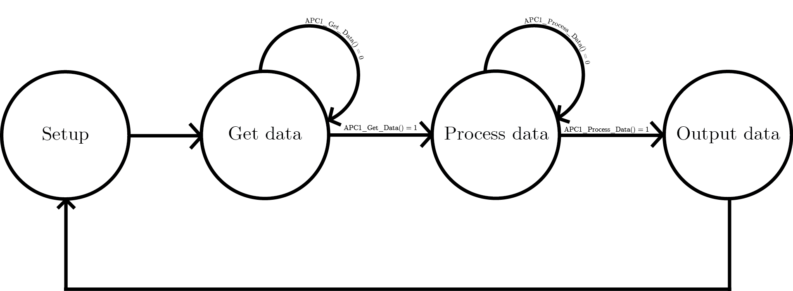

<h1>Arduino-APC1-sensor</h1>

Functions that enable the ScioSense APC1 sensor to work with Arduino

<h3>APC1 Functions</h3>

  <ul>
    <li>
      APC1_Setup() initializes the APC1 sensor, LCD module and terminal.
    </li>
    <li>
      APC1_Get_Data() requests newest set of measurement data from the sensor.
    </li>
    <li>
      APC1_Process_Data() processes measurement data into readable values, which are then stored into a struct.
    </li>
    <li>
      APC1_Print() prints measurement data to the terminal.
    </li>
    <li>
      APC1_Print_LCD() prints measurement data to the LCD module, if connected.
    </li>
    <li>
      APC1_Set_Idle() set the APC1 sensor to idle mode.
    </li>
    <li>
      APC1_Set_Measurement() set the APC1 sensor to measurement mode (passive).
    </li>
  </ul>

<h3>
  Connections
</h3>

  As is digital pin 2 and 3 are used as TX and RX for sensor. LCD is configured to work in 4 bit mode and uses the following pins:
  <ul>
    <li>
      RS to digital pin 5
    </li>
    <li>
      E to digital pin 6
    </li>
    <li>
      DB4 to digital pin 7
    </li>
    <li>
      DB5 to digital pin 8
    </li>
    <li>
      DB6 to digital pin 9
    </li>
    <li>
      DB7 to digital pin 10
    </li>
  </ul>
  To changed them, you have to edit APC1.h (for sensor) or APC1.cpp (for LCD).

<h3>
  Example program
</h3>

  In main.ino is an example program which requests data and prints it out on the terminal and LCD module.
  It works as a finite state machine (FSM):
  

<h3>
  Notes
</h3>

  Everything is written as C, not C++. Currently only measurement data can be received (device anwser for commands is not yet
  implemented). Gas sensor values though read and converted are not saved in the struct, neither shown in terminal or LCD.
  The sensor is in passive mode, so to get measurement values, they have to be requested by calling APC1_Get_Data().
  Tested on a Arduino Uno.

